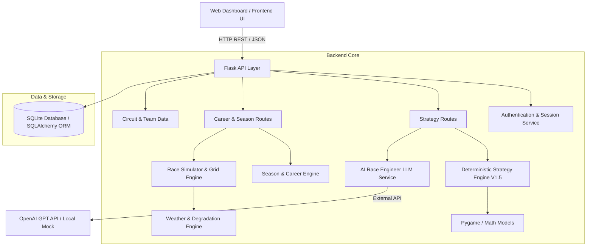
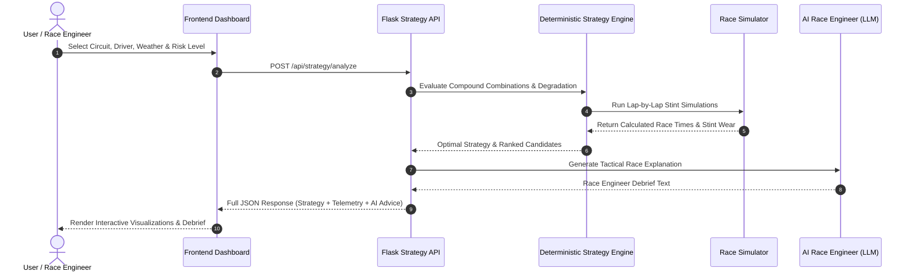

# 🏎️ Formula 1 AI Engine (F1 AI Engine)

> **Advanced F1 Race Strategy Optimization, Physics-Informed Simulation & Career Management Engine**

[](https://www.python.org/downloads/)
[](https://flask.palletsprojects.com/)
[](LICENSE)
[]()

The **F1 AI Engine** is a deterministic, multi-factor Formula 1 race strategy analysis, simulation, and team management platform. It combines physics-informed aerodynamic, tyre degradation, and weather modeling with an AI Race Engineer layer to evaluate optimum pit-stop windows, stint strategies, qualifying dynamics, and full career season progression.

---

## 🛠️ Key Features

- 🎯 **Deterministic Strategy Optimization**: Evaluates hundreds of compound permutations, pit-stop windows (1-stop, 2-stop, 3-stop), stint degradation curves, and track-position trade-offs.
- 🌧️ **Dynamic Weather & Track Evolution**: Models track condition shifts across Dry, Mixed, and Wet states with compound crossover penalties (Slicks, Intermediate, Full Wet).
- 🏎️ **Circuit-Sensitive Vehicle Dynamics**: Simulates track-specific demands (High Downforce vs. Low Drag, Power Sensitivity, Overtaking Difficulty, Pit Loss Time).
- 🤖 **AI Race Engineer (LLM Layer)**: Translates complex numerical simulation telemetry into tactical race-engineer debriefs using OpenAI GPT or local mock modes.
- 🏁 **Career & Season Engine**: Full F1 career mode featuring driver standings, constructor points, team R&D upgrades (Aero, Engine, Chassis, Reliability), and multi-race championships.
- 📊 **Real-Time Interactive Visualizer**: Visual telemetry dashboard featuring live strategy comparison, lap time projections, compound wear graphs, and stint analysis.

---

## 📐 System Architecture

The F1 AI Engine uses a modular, decoupled architecture separating deterministic calculation layers from LLM explanation services and interactive UI layers.



### Subsystem Breakdown

1. **Flask API Core (`backend/app.py`)**: High-performance RESTful API microservice registering modular blueprints for authentication, strategy analysis, career mode, drivers, teams, and circuit data.
2. **Strategy Engine (`backend/services/strategy_engine.py`)**: Deterministic calculations engine evaluating circuit grip level, tyre thermal degradation, fuel weight penalty, overtaking delta, and stint pacing.
3. **Race Simulator (`backend/simulation/race_simulator.py`)**: Multi-car lap-by-lap simulator accounting for aero drag, cornering efficiency, tyre wear curves, driver consistency, pit-stop time loss, and yellow/safety car margins.
4. **AI Race Engineer (`backend/services/llm_service.py`)**: Formulates tactical explanations of deterministic mathematical decisions into professional race-engineering reports.
5. **Career & Upgrade Engine (`backend/services/upgrade_engine.py` & `season_engine.py`)**: Handles budget caps, team R&D progression, performance point distribution, driver market stats, and championship scoreboards.
6. **Persistence Layer (`database/`)**: Relational SQLite schema managed via Flask-SQLAlchemy for users, teams, drivers, circuits, car attributes, and season standings.

---

## 🔁 Data & Simulation Flow



---

## 🔬 Physics & Mathematical Modeling

The deterministic engine utilizes physics-informed formulas to project lap times and strategy performance:

### 1. Lap Time Calculation
$$\text{Lap Time} = \text{Base Pace} + \text{Tyre Delta} + \text{Degradation Penalty} + \text{Fuel Loss} + \text{Driver Variance} + \text{Weather Penalty}$$

- **Base Pace**: Circuit lap baseline adjusted by vehicle Aero, Chassis, and Power Unit ratings.
- **Tyre Compound Base Paces**:
  - `Soft`: $+0.00\,\text{s}$ (Maximum immediate grip)
  - `Medium`: $+0.45\,\text{s}$ (Balanced pace and durability)
  - `Hard`: $+1.05\,\text{s}$ (High durability, reduced initial grip)
  - `Intermediate`: $+2.50\,\text{s}$ (Damp/wet crossover)
  - `Full Wet`: $+4.00\,\text{s}$ (Heavy standing water)

### 2. Tyre Degradation Model
$$\text{Degradation Penalty}(l) = \text{DegRate} \times \left( \frac{\text{Lap } l}{\text{Nominal Life}} \right)^{1.4} \times \text{Track Severity Factor}$$

---

## 📡 API Reference

### 🔐 Authentication (`/api/auth`)
| Method | Endpoint | Description |
| :--- | :--- | :--- |
| `POST` | `/api/auth/register` | Register new user account |
| `POST` | `/api/auth/login` | Authenticate user and initialize session |
| `GET` | `/api/auth/me` | Fetch active user profile |
| `POST` | `/api/auth/logout` | Terminate session |

### 🏁 Strategy & Simulation (`/api/strategy`)
| Method | Endpoint | Description |
| :--- | :--- | :--- |
| `POST` | `/api/strategy/analyze` | Execute strategy simulation & AI debrief |
| `GET` | `/api/strategy/circuits` | Get available circuits & track characteristics |

### 🏎️ Career & Championship (`/api/career`)
| Method | Endpoint | Description |
| :--- | :--- | :--- |
| `POST` | `/api/career/start` | Initialize new F1 career mode session |
| `GET` | `/api/career/dashboard` | Fetch team status, driver stats & upgrades |
| `POST` | `/api/career/race` | Simulate qualifying & race weekend |
| `POST` | `/api/career/upgrade` | Apply team R&D performance upgrades |
| `GET` | `/api/career/standings` | Fetch driver & constructor standings |

---

## 📁 Repository Structure

```
f1-ai-engine/
├── backend/
│   ├── models/            # SQLAlchemy database schemas (User, Team, Driver, Circuit, Upgrade)
│   ├── routes/            # Flask blueprint endpoints (Auth, Strategy, Career, Circuits, Teams)
│   ├── services/          # Strategy Engine, LLM Explanation Service, R&D Upgrade Engine
│   ├── simulation/        # Race Simulator, Qualifying Engine, Weather & Track Evolution
│   ├── config.py          # Configuration settings & environment handling
│   ├── extensions.py      # Database extension initializers
│   └── app.py             # Main Flask application entry point
├── database/
│   ├── f1.db              # SQLite Database instance
│   ├── init_db.py         # Database initialization script
│   └── seed.py            # Seeding script for F1 teams, drivers, and circuits
├── frontend/
│   ├── index.html         # Landing page UI
│   ├── login.html         # User authentication portal
│   ├── dashboard.html     # Real-time Strategy Telemetry & Career Visualizer
│   └── data.js            # Initial dataset definitions
├── tests/
│   └── test_strategy_engine.py  # Unit & integration tests
├── .env                   # Environment variable template
├── .gitignore             # Git ignore patterns
├── requirements.txt       # Python dependencies
└── README.md              # Project documentation
```

---

## 💻 Installation & Setup

### Prerequisites
- **Python 3.10+**
- **Git**

### 1. Clone & Navigate to Repository
```bash
git clone https://github.com/kavyaveerapur/f1-ai-engine.git
cd f1-ai-engine/f1-ai-engine
```

### 2. Create Virtual Environment
```bash
# On Windows PowerShell
python -m venv venv
.\venv\Scripts\Activate.ps1

# On macOS/Linux
python3 -m venv venv
source venv/bin/activate
```

### 3. Install Dependencies
```bash
pip install -r requirements.txt
```

### 4. Configure Environment (`.env`)
Create a `.env` file in the project directory:
```env
FLASK_ENV=development
SECRET_KEY=your_secret_key_here
DATABASE_URL=sqlite:///database/f1.db

# LLM Configuration (options: mock | openai)
LLM_MODE=mock
OPENAI_API_KEY=your_openai_api_key_here
OPENAI_MODEL=gpt-4o-mini
```

### 5. Initialize & Seed Database
```bash
python -m database.seed
```

### 6. Start the Backend Server
```bash
python -m backend.app
```
The Flask API server will run at: `http://127.0.0.1:5000`

### 7. Launch Frontend Visualizer
Open `frontend/dashboard.html` or `frontend/index.html` in your web browser.

---

## 🧪 Running Tests & Simulation Verification

Execute strategy engine tests and race variation benchmarks:
```bash
pytest tests/
python test_race_variation.py
python race_test.py
```

---

## 🔒 Security & Commit History Audit Verification

This repository has been audited to guarantee:
- 📌 **Clean Git Tree**: Origin points to `https://github.com/kavyaveerapur/f1-ai-engine.git`.
- 📌 **Single Author Attribution**: Clean single-committer history with no legacy fork metadata or external maintainers.
- 📌 **Zero Sensitive Leakage**: No hardcoded API keys or external developer footprints.

---

## 📜 License

This project is licensed under the MIT License - see the [LICENSE](LICENSE) file for details.
